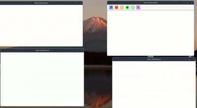

# WhiteBoard

WhiteBoard is a collaborative, real-time whiteboard application written in Rust. It allows multiple users to draw together on a shared canvas over the network, supporting several drawing tools and synchronization between clients and a central server.

---

## Features

- **Real-time Drawing:** Multiple users can draw simultaneously, with updates synchronized across all connected clients.
- **Multiple Drawing Tools:** Includes freehand pen, rectangles (filled and outline), circles (filled and outline), and straight lines.
- **Clear Canvas:** A keyboard shortcut allows the canvas to be cleared for everyone.
- **Modern UI:** Tool selection via a navigation bar with color-coded icons.
- **Client-Server Architecture:** Uses TCP sockets for communication between the Rust server and clients.
- **Concurrency:** Leverages async Rust (tokio) and threads for efficient networking and rendering.

---

## Architecture

The project consists of three main crates:

- `server`: Handles client connections, receives drawing operations, and broadcasts updates.
- `client`: Renders the canvas, sends user drawing actions to the server, and listens for updates from other users.
- `shared`: Contains data models and drawing logic common to server and client.

---

## Setup & Usage

### Prerequisites

- [Rust](https://www.rust-lang.org/tools/install) (stable)
- [cargo](https://doc.rust-lang.org/cargo/)
- [macroquad](https://crates.io/crates/macroquad) dependencies (for graphics)
- [tokio](https://crates.io/crates/tokio)
- [bincode](https://crates.io/crates/bincode)
- (Optional) `anyhow`, `serde` crates

### Building

Clone the repository, then build the shared, server, and client:

```bash
git clone https://github.com/aminehabchi/White_Board.git
cd White_Board

# Build shared library (optional, as used as a dependency)
cargo build -p shared

# Build and run server
cd server
cargo run

# Build and run client (in a new terminal)
cd ../client
cargo run
```

### Running

1. **Start the server:**

   - From the `server` directory: `cargo run`
   - The server listens on `127.0.0.1:8080` by default.

2. **Start one or more clients:**
   - From the `client` directory: `cargo run`
   - Each client window allows drawing and will synchronize with all others connected to the server.

### Controls

- Use the navigation bar at the top to select between Pen, Rectangle, Rectangle Outline, Circle, Circle Outline, and Line.
- Draw on the canvas using your mouse.
- Press `Space` to clear the canvas for everyone.

---

## Example
> Disclaimer: As you can see from this gif, my drawing skills are... let's just say "abstract" 🖍️😂  
> Please focus on the app features, not my artistic abilities! 🎨🙈



---

## Project Structure

```
White_Board/
├── client/   # Client application (UI, drawing, network)
├── server/   # Server application (network, sync)
├── shared/   # Shared data models and drawing code
└── README.md
```

---

## Contributing

Pull requests are welcome! For major changes, please open an issue first to discuss what you would like to change.

---

## License

This project currently does not specify a license. Please contact the author for permissions and intended use.

---

## Author

- [aminehabchi](https://github.com/aminehabchi)
- [achnitreda](https://github.com/achnitreda)
